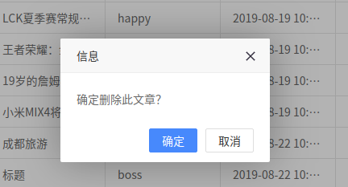

##前言

用于给管理员管理文章，可以进行的操作有添加文章，删除文章，查找文章，修改文章

## 正文

### 主要功能

实现了文章标题、作者、标签、上传时间、发布状态、ID的显示，方便管理员进行操作


#### 后台主界面

##### 效果如下


管理员可以通过不同条件的筛选，查看指定的文章，添加按钮用于管理员添加文章，编辑按钮用于管理员修改文章，编辑后的删除按钮用于管理员删除单篇文章，添加按钮前的删除按钮可用于删除一篇或多篇文章

1. 前端

```
	table.render({
    elem: '#LAY-app-content-list'
    ,url: "content_list"
    ,cols: [[
      {type: 'checkbox', fixed: 'left'}
      ,{field: 'id', width: 100, title: '文章ID', sort: true}
      ,{field: 'label', title: '文章标签', minWidth: 100}
      ,{field: 'title', title: '文章标题'}
      ,{field: 'author', title: '作者'}
      ,{field: 'uploadtime', title: '上传时间', sort: true}
      ,{field: 'status', title: '发布状态', templet: '#buttonTpl', minWidth: 80, align: 'center'}
      ,{title: '操作', minWidth: 150, align: 'center', fixed: 'right', toolbar: '#table-content-list'}
    ]]
    ,page: true
    ,limit: 10
    ,limits: [10, 15, 20, 25, 30]
    ,text: '对不起，加载出现异常！'
  });
  	...
  	...
  	...
	var $ = layui.$, active = {
      batchdel: function(){
        var checkStatus = table.checkStatus('LAY-app-content-list')
        ,checkData = checkStatus.data; //得到选中的数据
        if(checkData.length === 0){
          return layer.msg('请选择数据');
        }
        var delList=[];//创建一个数组
        checkData.forEach(function(n,i){//遍历
          delList.push(n.id);//给数组添加值
        });
        layer.confirm('确定删除吗？', function(index) {
          $.ajax({ 
          url: "delete_articles"
          ,type:"post"
          ,data: "id="+delList
          ,done: function(res){
            alert("删除成功");
          },
          error: function(res){
            alert("删除失败");
          }
          });
          table.reload('LAY-app-content-list');//重载表格
          layer.msg('已删除');
        });
      },
      add: function(){
        layer.open({
          type: 2
          ,title: '添加文章'
          ,content: 'app_listform'
          ,maxmin: true
          ,area: ['550px', '550px']
          ,btn: ['确定', '取消']
          ,yes: function(index, layero){
            //点击确认触发 iframe 内容中的按钮提交
            var submit = layero.find('iframe').contents().find("#layuiadmin-app-form-submit");
            submit.click();

```
通过前端发送请求，后台将数据查出后传给前端，在通过表格的形式显示在页面上，之后监听获取管理员将要进行的操作，传给后台

2. 后台

```
@app.route('/content_list', methods=['POST', 'GET'])
@utils.auth_wrapper(all_user.app_index,"auth")
def content_list():
    if request.method == "POST":
        req_id = request.form.get("id")
        req_author = request.form.get("author")
        req_title = request.form.get("title")
        req_label = request.form.get("label")
        page = request.form.get("page")
        blog_article = Article()
        data = blog_article.data_all_display()
        if not data:
            res = {"code": -1,
            "msg": "没有找到",
            "count": 0,
            "data": [] }
        ...
        ...
        ...
        b = page*10
        # print(b)
        if not a:
            res = {"code": -1,
            "msg": "没有找到",
            "count": 0,
            "data": [] }
        else:
            res = {"code": 0,
            "msg": "",
            "count": len(data),
            "data": a[b:b+10] }
        res = json.dumps(res)
        response = make_response(res)
        response.headers["Access-Control-Allow-Origin"] = "*"
        return response
```

后台得到请求后，在数据库中查找，并将查询到的数据按照前端需要的格式返回给前端

#### 添加文章界面

##### 效果如下


1. 前端

```
admin.req({
        url: "content"
        ,type:"get"
        ,data: field
        ,done: function(res){        
          layer.msg('添加成功', {
            icon: 6
            ,time: 1000
          });
        },
        error: function(res){
          layer.msg('添加失败', {
            icon: 6
            ,time: 1000
          });
        }
      });
```
得到管理员的操作后，向后台发起请求，并将监听到的数据传给后台

2. 后台


```
@app.route('/content', methods=['POST', 'GET'])
@utils.auth_wrapper(all_user.app_index,"auth")
def content():
	title = request.args.get("title")
        user_id = request.args.get("author")
        content = request.args.get("content")
        label = request.args.get("label")
        classification = request.args.get("classification")
        status = request.args.get("status")
        status = status_num(status)
        ...
        ...
        ...
        content = cgi.escape(content)
        blog_article = Article()
        label_id = transformation(label)
        class_id = transformation1(classification)
        blog_article.increase(user_id,title,class_id,content,label_id,status)
        blog_article.commit()
        res = {"code": 0,
            "msg": "",
            "data": [] }
        res = json.dumps(res)
        response = make_response(res)
        response.headers["Access-Control-Allow-Origin"] = "*"
        return response
```
后台得到请求后，将接受到的数据插入到数据库当中，并返回一个信号给前端

#### 编辑文章

##### 效果如下


1. 前端

```
	layer.open({
	    type: 2
	    ,title: '编辑文章'
	    ,content: 'app_listform?id='+ data.id
	    ,maxmin: true
	    ,area: ['550px', '550px']
	    ,btn: ['确定', '取消']
	    ,yes: function(index, layero){
	      var iframeWindow = window['layui-layer-iframe'+ index]
	      ,submit = layero.find('iframe').contents().find("#layuiadmin-app-form-edit");
	    console.log(data.id)
	    // console.log(typeof data.id);
	    var b = {
	      id:data.id
	    }
	      //监听提交
	      iframeWindow.layui.form.on('submit(layuiadmin-app-form-edit)', function(data){
	        var field = data.field; //获取提交的字段
	        console.log(field)
	        // a = parseInt(data.id)
	        function combin(a,b){
	          for(var i in b){
	            a[i] = b[i]
	          }
	          return a;
	        }
	        var new_field = combin(field,b)
	        console.log(new_field)
	        //提交 Ajax 成功后，静态更新表格中的数据
	        $.ajax({ 
	        url: "content_modify"//layui.setter.base + 'json/user/reg.js' //实际使用请改成服务端真实接口
	        ,type:"get"
	        ,data: new_field
	        ,done: function(res){        
	          alert("修改成功");
	        },
	        error: function(res){
	          alert("修改失败");
	        }
	        }); 
```
前端监听到点击事件是，返回一个弹窗，管理员将要修改的内容输入然后提交，监听提交得到输入的字段，将其传给后台


2. 后台

```
@app.route('/content_modify', methods=['POST', 'GET'])
@utils.auth_wrapper(all_user.app_index,"auth")
def content_modify():
	title = request.args.get("title")
		user_id = request.args.get("author")
		content = request.args.get("content")
		label = request.args.get("label")
		classification = request.args.get("classification")
		status = request.args.get("status")
		article_id = request.args.get("id")
		status = status_num(status)
		if not user_id:
		    user_id = 0
		else:
		    user_id = int (user_id)
		print(title)
		blog_article = Article()
		label_id = transformation(label)
		class_id = transformation1(classification)
		blog_article.modify(user_id,title,class_id,content,label_id,status,article_id)
		blog_article.commit()
		res = {"code": 0,
		    "msg": "",
		    "data": [] }
		res = json.dumps(res)
		response = make_response(res)
		response.headers["Access-Control-Allow-Origin"] = "*"
		return response
```

后台接收到前端传来的请求后，将修改的数据更新到数据库当中

#### 删除文章

##### 效果如下



部分代码如下：

```
@app.route('/delete_articles', methods=['POST', 'GET'])
@utils.auth_wrapper(all_user.app_index,"auth")
def delete_articles():
    delete_id = request.form.get("id")
    blog_article = Article()
    blog_article.delete(delete_id)  
    blog_article.commit()
    res = {"code": 0,
        "msg": "",
        "data": [] }
    res = json.dumps(res)
    response = make_response(res)
    response.headers["Access-Control-Allow-Origin"] = "*"
    return response
```

后台接收到请求后，找到对应ID的文章，将其文章状态修改为已删除


## 结尾

在本次开发过程中，刚开始不知道怎么运用ajax传输数据，通过查询资料后得到了解决，在编写过程中偶尔会忽略传输的值的数据类型，导致调试出错，在多次检查之后，终于不会在犯这个错误了